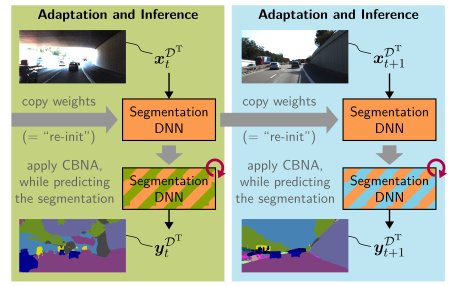

# Continual BatchNorm Adaptation (CBNA) for Semantic Segmentation

[Marvin Klingner](https://www.tu-braunschweig.de/en/ifn/institute/team/sv/klingner), Mouadh Ayache, and [Tim Fingscheidt](https://www.tu-braunschweig.de/en/ifn/institute/team/sv/fingscheidt)

[Link to paper](https://arxiv.org/abs/2203.01074) 

<p align="center">
  
</p>

## Citation

If you find our work useful or interesting, please consider citing [our paper](https://arxiv.org/abs/2011.08502):

```
@article{klingner2020unsupervised,
 title   = {{Continual BatchNorm Adaptation (CBNA) for Semantic Segmentation}},
 author  = {Marvin Klingner and
            Mouadh Ayache and
            Tim Fingscheidt
           },
 year = {2022},
 journal = {IEEE Transactions on Intelligent Transportation Systems (T-ITS)}
}
```

## Getting Started

To run our code you need to go through the following steps: 
1. Start a fresh conda environment and install the necessary packages. 
   We have provided an environment.yml with our used environment.

2. Create a dataset folder where all the used datasets will be stored. Specify the environment variables `UBNA_DIR_DATASET` and `UBNA_DIR_CHECKPOINT`, leading to the paths of this dataset folder and the folder where the checkpoints are to be saved. Depending on your operating system, this can be done as follows:
    * Windows: 
        ```bash 
        setx UBNA_DIR_DATASET <PATH_TO_DATASET>
        ```
    * Linux:
        ```bash
        export UBNA_DIR_DATASET=<PATH_TO_DATASET>
        ```
        
3. To download the datasets, you can use the following steps. Note that you do not necessarily need all datasets for all experiments (e.g. for GTA to Cityscapes you only need gta-5 and Cityscapes and Cityscapes sequence datasets), but if you download all datasets mentioned here, you should be able to run all experiments described in the paper:
   * Cityscapes: Create a folder called `cityscapes` in your dataset folder. Go to https://www.cityscapes-dataset.com/downloads/, log in, download and unpack the following dataset parts into that folder:
        * leftImg8bit_trainvaltest.zip
        * gtFine_trainvaltest.zip
   * Cityscapes (sequences): Create a folder called `cityscapes_sequence` in your dataset folder. Go to https://www.cityscapes-dataset.com/downloads/, log in, download and unpack the following dataset parts into that folder:
        * leftImg8bit_sequence_trainvaltest.zip
   * GTA-5: Download all parts of the GTA-5 dataset from https://download.visinf.tu-darmstadt.de/data/from_games/. Put all color images in a subfolder `images` and all labels in a subfolder `labels`. Rename the main folder to `gta5` afterwards.
   * GTA-5 (full split): Create an empty folder called `gta5_full_split`. It will be used later to store the split information for the GTA-5 dataset.
   
4. Download the .json files from the following download links and place them in the dataset folders. 
    * Cityscapes: https://drive.google.com/drive/folders/1E9RdGX-uAtrU1p_OLjOrVI4tKBdZwg6W?usp=sharing
    * Cityscapes (sequences): https://drive.google.com/drive/folders/1EKGfzjotMc8_R42nHaMmwIfyyv0W4Q42?usp=sharing
    * GTA-5: https://drive.google.com/drive/folders/1uv4iaOiJ0fbZOHcrTcmFLqje5WdXazPR?usp=sharing
    * GTA-5 (full split): https://drive.google.com/drive/folders/18t4Alb8jhk8Y7BqbxAAK9k8-Yqx1wxBE?usp=sharing
    
    The resulting folder structure should look as follows. 

    ```bash
    .
    ├── cityscapes
    │   ├── gtFine
    │   ├── leftImg8bit
    │   ├── basic_files.json
    │   ├── parameters.json
    │   ├── train.json
    │   ├── validation.json
    │   └── test.json
    │ 
    ├── cityscapes_sequence
    │   ├── leftImg8bit_sequence
    │   ├── basic_files.json
    │   ├── parameters.json
    │   ├── train.json
    │   ├── validation.json
    │   └── test.json
    │ 
    ├── gta5
    │   ├── images
    │   ├── labels
    │   ├── basic_files.json
    │   └── parameters.json
    │
    |── gta5_full_split
    |   └── train.json
    ```

# Pretraining of the Semantic Segmentation Network

With this code example we demonstrate the adaptation from GTA-5 to Cityscapes as described in our paper.
For pretraining the semantic segmentation network, there is a `train.py` provided. 
There are different options available. For a full list see `arguments.py`. 
Our pretraining procedure is given by the following command and involves using only the weighted cross-entropy loss as described in the paper.

```
python3 train.py \
        --model-name segmentation_gta5_vgg16 \
        --segmentation-training-loaders "gta5_train" \
        --segmentation-resize-height 576 \
        --segmentation-resize-width 1024 \
        --segmentation-training-batch-size 12
```

You can of course also simply run the `train_gta_vgg16.sh` shell script located in the `experiments/gta_to_cs/` directory.
The pretrained model will be saved in the folder `./pretrained/segmentation_gta5_vgg16`.

If you would like to only try out the adaptation, you can download our [pre-trained model](https://drive.google.com/file/d/1uw-H3cTMOl_iL3Bd-ivzSJhpMQr112nS/view?usp=sharing).
Please extract the zip file into the `./pretrained/` folder.

# Adaptation of the Network to New Domains

For adaption of the network to the new domain using our *CBNA*-method, execute the following command:
 
```  
python3 adapt.py \
      --sys-best-effort-determinism \
      --model-name "cbna_adaptation" \
      --model-load segmentation_gta5_vgg16/checkpoints/epoch_20 \
      --model-disable-lr-loading \
      --adaptation-batch-size 1 \
      --adaptation-loaders "cityscapes_sequence" \
      --adaptation-resize-height 512 \
      --adaptation-resize-width 1024 \
      --adaptation-bn-momentum 0.2 \
      --adaptation-batches 500 \
      --model-cbna-bn-inference
```        

Make sure that the `model.pth` file of the pretrained model is located in the folder `./pretrained_models/segmentation_gta5_vgg16/checkpoints/epoch_20` specified in the `model-load` argument. 
After adaption, the model will be saved in the directory `ubna_adapted_models` within the directory you specified before with the environment variable `UBNA_DIR_CHECKPOINT`.

## License
This code is licensed under the <b>MIT-License</b> feel free to use it within the boundaries of this license.
